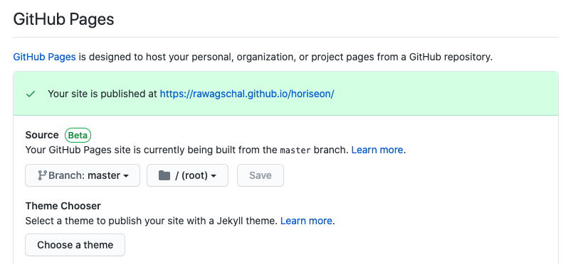
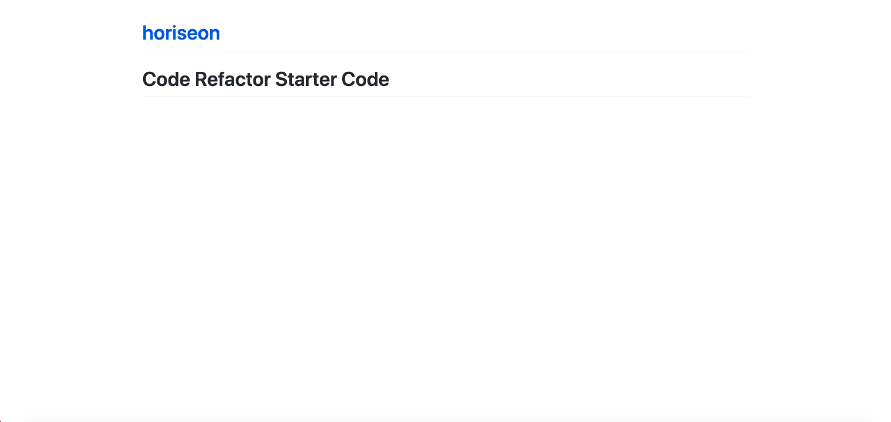

# Code Refactor Starter Code for Horiseon
## Description
This is a codebased that follows accessibility standards to optimize the Horiseon marketing agency's website for search engines. 

To follow accessibility standards, the code has ben refactored to include accesible alt attributes for image elements, semantic HTML5 elements, and consildated CSS. 

## Live URL Issue

I attempted to publish my site to GitHub Pages by going to the settings in my repository and received this message:

I feel like there is a step I am missing in the command line, because when I attempt to navigate to the URL I see the below: 

​
## License
​
MIT License

Copyright (c) [2020] [Rachel Wagschal]

Permission is hereby granted, free of charge, to any person obtaining a copy
of this software and associated documentation files (the "Software"), to deal
in the Software without restriction, including without limitation the rights
to use, copy, modify, merge, publish, distribute, sublicense, and/or sell
copies of the Software, and to permit persons to whom the Software is
furnished to do so, subject to the following conditions:

The above copyright notice and this permission notice shall be included in all
copies or substantial portions of the Software.

THE SOFTWARE IS PROVIDED "AS IS", WITHOUT WARRANTY OF ANY KIND, EXPRESS OR
IMPLIED, INCLUDING BUT NOT LIMITED TO THE WARRANTIES OF MERCHANTABILITY,
FITNESS FOR A PARTICULAR PURPOSE AND NONINFRINGEMENT. IN NO EVENT SHALL THE
AUTHORS OR COPYRIGHT HOLDERS BE LIABLE FOR ANY CLAIM, DAMAGES OR OTHER
LIABILITY, WHETHER IN AN ACTION OF CONTRACT, TORT OR OTHERWISE, ARISING FROM,
OUT OF OR IN CONNECTION WITH THE SOFTWARE OR THE USE OR OTHER DEALINGS IN THE
SOFTWARE.